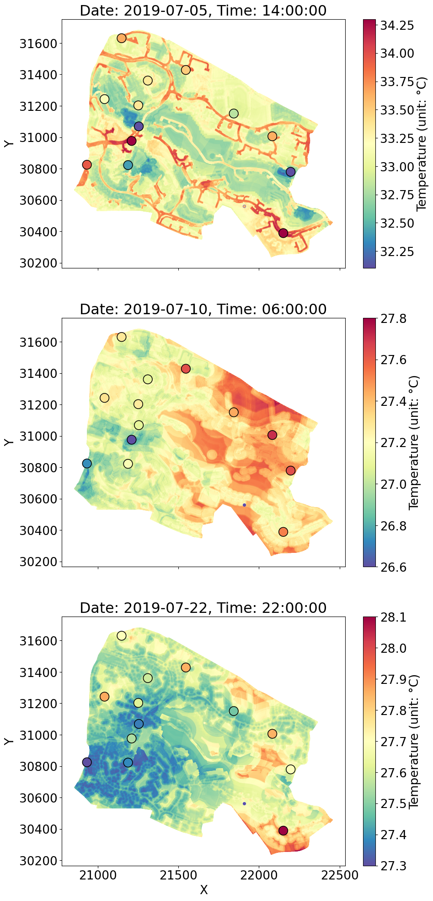

# Microclimate spatio-temporal prediction using deep learning and land use data
This repository contains the research compendium of our latest work, "Microclimate spatio-temporal prediction using deep learning and land use data." This study proposes a novel approach to predict microclimate: the Geo-LSTM-Kriging model, which is applicable for fine-scale microclimate prediction within a few hundred meters around weather stations. 

The compendium includes all the data and code needed to reproduce the analysis. More details can be found in our paper:

> xxx, xxx, xxx, xxx and xxx, (2024).
> *Microclimate spatio-temporal prediction using deep learning and land use data*.
> *Building and Environment*. <https://doi.org/xxx/xxx>

## Citation

If you are interested in using this code in your research, please cite our paper:
```
@article{2024microclimate,
  title={Microclimate spatio-temporal prediction using deep learning and land use data},
  author={xxx},
  year={2024},
  note={In Revision}
}
```

## Repository Structure

```
./
├── python                                        # 
│   ├── requirement.txt                           # File containing the list of Python packages the project uses
│   ├── Model_train.ipynb                         # Python notebook for constructing and training the models used in study
│   ├── Model_evaluation_and_plot.ipynb           # Python notebook for validating the predictive error of models and plot the validation results
│   └── trainednw                                 # Folder to save trained network parameters
│       └── ...                                   #
├── data                                          #
│   ├──1m_GridPoints_distTo_and_zones_3414.csv    # large file that contains LULC data of NUS campus
│   ├──GridPoints_TreesAndStreets_3414.csv        # LULC data of trees and streets
│   ├──WSPoints_TreesAndStreets_3414.csv          # LULC data of weather stations
│   ├──SGP_Singapore.486980_IWEC.epw              # Singapore IWEC data of year 2019
│   ├──SGP_SINGAPORE-CHANGI-AP_486980S_19.epw     # Changi Airport weather data of year 2019
│   ├──RH0719.csv                                 # RH data of weather stations in 2019/07
│   ├──RH0819.csv                                 # RH data of weather stations in 2019/08
│   ├──Tem0719.csv                                # Temperature data of weather stations in 2019/07
│   ├──Tem0819.csv                                # Temperature data of weather stations in 2019/08
│   ├──sr0719.csv                                 # Solar radiation data of weather stations in 2019/07
│   └──ws0719.csv                                 # Wind speed data of weather stations in 2019/07 
├── src                                           # sources used in README.md
└── paper                                         # 
    ├── figs                                      # Figures used in the paper
    │   └── ...                                   #
    ├── main.tex                                  # LaTeX source document
    └── cas-refs.bib                              # Bibliographic information file
    └── ...
```

*This repository contains a large data file named `1m_GridPoints_distTo_and_zones_3414.csv`, located in the `/data` directory.*

## Approach

This study presents a novel approach for urban microclimate prediction, termed the Geo-LSTM-Kriging model. The model integrates spatial, temporal, and environmental factors to provide accurate microclimate predictions at a high spatial resolution of 1 meter × 1 meter and shorter time intervals of 10 minutes. The approach incorporates three key components: 
**Geo-layer**: Processes and learns from land use/land cover (LULC) data; 
**LSTM layer**: Extracts and learns information from historical data using Long Short-Term Memory networks; 
**Kriging layer**: Extracts spatial distance information.

To comprehensively validate the performance of the proposed model, two levels of baseline models were designed and compared with experimental results: 

#### Level 1 Baselines

Comparison with classical types of machine learning models, including **LSTM** and **GRU** for temporal data processing, and **Ordinary Kriging** and **Regression Kriging** interpolation for spatial data.

#### Level 2 Baselines

Comparison with traditional microclimate data accessing methods, such as directly using data from **neighboring weather stations**, representative urban weather stations (e.g., **Changi Airport Weather station data**), and International Weather for Energy Calculations (**IWEC**) data.

<div style="display: flex;">
     
     
</div>

The above figure illustrates a typical application scenario of our model, showcasing its capability to provide high-precision, high-resolution visualized predictions for microclimate changes influenced by building and environmental conditions within a small area. Although not depicting actual buildings or roads, the predictions capture the spatial outlines, particularly during peak periods like midday. This tool offers valuable insights for urban planners and decision-makers, aiding in considerations such as vegetation coverage or building modifications. 

If you would like to delve deeper into the algorithm and detailed analysis of model results, feel free to explore our research paper.

## License

This project is licensed under the [LICENSE](LICENSE).


